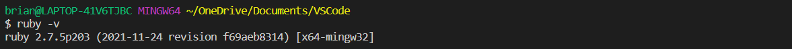
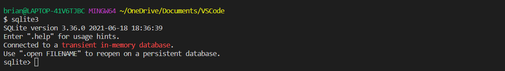
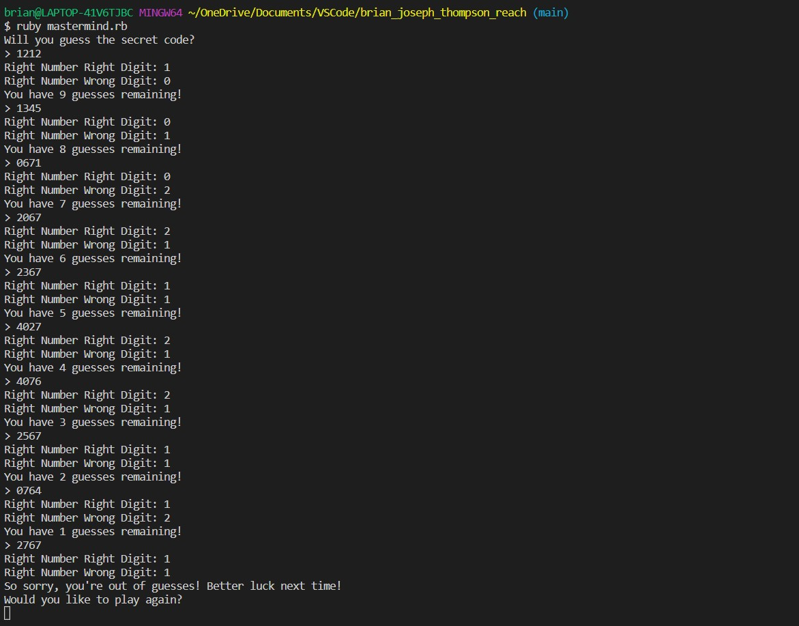
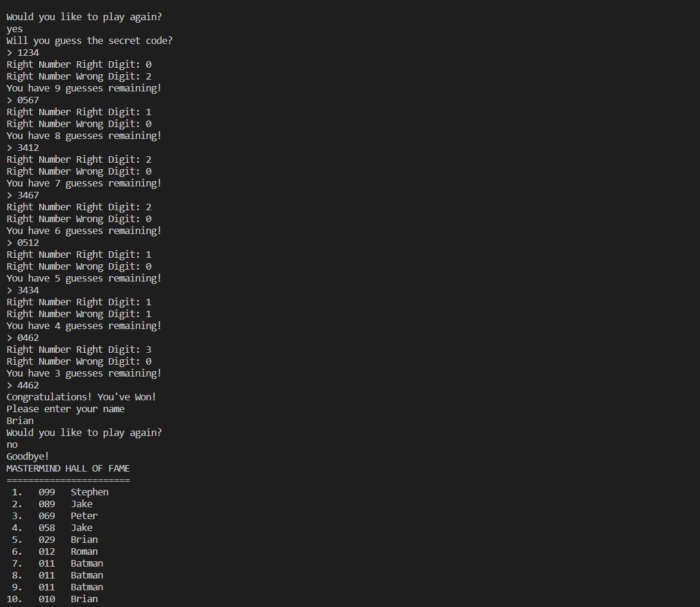
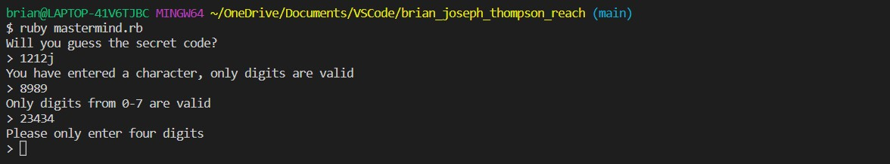

# Mastermind Game - REACH

This project is a command line implementation of the game Mastermind completed for the REACH application process.  
This project was completed in Ruby with SQLite for the SQL embedded database.

## Description

Mastermind is a game composed of 8 pieces of different colors.  
A secret code is then composed of 4 distinct pieces.

The player has 10 attempts to find the secret code.  
After each input, the game indicates to the player the number of well placed pieces and the number of misplaced pieces.

For this implementation we will use numbers in lieu of colors and digits in lieu of pieces.  
Numbered digits are '0' '1' '2' '3' '4' '5' '6' '7'.

A well placed piece is when a player has guessed the right number at the right digit.  
A misplaced piece is when a player has guessed the right number but at a different digit location.

After each turn the player will be prompted with a message indicating the:
* Right Number Right Digit placed
* Right Number Wrong Digit placed
* Remaining guesses the player has

If the player finds the code, they win, and the game stops. They will be prompted to play again.  
If they player chooses not to play again, they will be prompted with a request for their name.  
The player score and name will be added to the Hall of Fame, which will then display the top ten player scores.

## Getting Started

### Dependencies

* Ruby
* SQLite

### Installation

* Ruby

  * Begin by checking if you already have Ruby installed. Enter the below into the command line:
    >```
    > `ruby -v`
    >```
    > If you do have ruby installed you should see something similar to this:
    >
    > 

  * If you do not have Ruby installed please visit the [Ruby Installer website](https://rubyinstaller.org/) for
    installation instructions.

* SQLite

  * Begin by checking if you already have SQLite installed. Enter the below in the command line:
    >```
    > `sqlite3`
    >```
    > If you do have SQLite installed you should see a similar message to the one below:
    >
    > 
    >
    > Enter Ctrl + d to exit the SQLite command prompt.

  * Please visit [this website](https://www.devdungeon.com/content/ruby-sqlite-tutorial) for detailed instructions on how to install SQLite as a Ruby gem.

* Cloning the Repository
  * Clone the repository into a folder titled brian_joseph_thompson_reach by executing the below:

```
  git clone https://github.com/BrianJosephThompson/REACH-Mastermind.git brian_joseph_thompson_reach
```

### Playing The Game

Navigate to the folder you have cloned the project into. Execute the game with  
```
ruby mastermind.rb
```

Regardless of whether the player wins or loses they will be prompted to play again:



If a player chooses not to play again they will be prompted for their name and the Hall of Fame will be printed and 
the program will be exited.  
An example of a winning game with the Hall of Fame:



Only valid numbers from 0-7 are accepted as input, if a user enters something else the computer will notify them of their error:




### Building the Game

My process for building this game went as follows:
